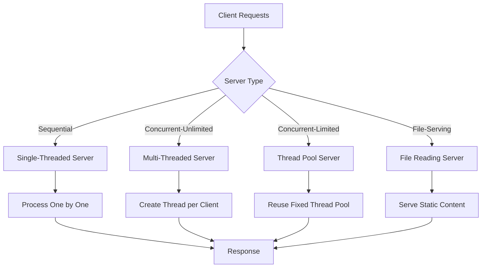

# 🚀 Java Web Server Implementation

[](https://www.oracle.com/java/)
[](https://opensource.org/licenses/MIT)
[](https://github.com/dev-priyanshu15/WEB-SERVER-JAVA)
[](https://github.com/dev-priyanshu15/WEB-SERVER-JAVA/pulls)

> A comprehensive Java web server implementation showcasing different server architectures, concurrent programming patterns, and performance optimization techniques. Perfect for learning socket programming, multithreading, and server design patterns.

## 📖 Table of Contents

- [🌟 Features](#-features)
- [🏗️ Architecture Overview](#️-architecture-overview)
- [🎯 Learning Objectives](#-learning-objectives)
- [📋 Prerequisites](#-prerequisites)
- [⚡ Quick Start](#-quick-start)
- [🔧 Server Implementations](#-server-implementations)
- [📊 Performance Comparison](#-performance-comparison)
- [🧪 Testing & Benchmarking](#-testing--benchmarking)
- [💡 Code Examples](#-code-examples)
- [🚨 Troubleshooting](#-troubleshooting)
- [🤝 Contributing](#-contributing)
- [📚 Resources](#-resources)

## 🌟 Features

✅ **Four distinct server architectures** with progressive complexity  
✅ **Socket programming** fundamentals and advanced concepts  
✅ **Thread management** patterns (single, multi, pool-based)  
✅ **File serving capabilities** with memory optimization  
✅ **Load testing tools** built-in for performance analysis  
✅ **Comprehensive documentation** with code examples  
✅ **Production-ready patterns** for scalable server design  

## 🏗️ Architecture Overview



## 🎯 Learning Objectives

This project teaches essential concepts in:

**Network Programming**
- TCP/IP socket communication
- Client-server architecture patterns
- HTTP protocol fundamentals

**Concurrency & Threading**  
- Single vs multi-threaded architectures
- Thread pool management and optimization
- Resource sharing and synchronization

**Performance Engineering**
- Scalability patterns and trade-offs
- Memory management in server applications
- Load testing and benchmarking techniques

**Software Design**
- Server architecture patterns
- Resource management strategies
- Error handling and fault tolerance

## 📋 Prerequisites

| Requirement | Version | Purpose |
|------------|---------|---------|
| **Java JDK** | 8+ | Core runtime and compilation |
| **Command Line** | Any | Running servers and clients |
| **Basic Knowledge** | - | Socket programming concepts |
| **Optional: IDE** | IntelliJ/Eclipse | Development environment |

## ⚡ Quick Start

### 1. Clone & Setup
```bash
git clone https://github.com/dev-priyanshu15/WEB-SERVER-JAVA.git
cd WEB-SERVER-JAVA
```

### 2. Choose Your Server
```bash
# Start with the simplest implementation
cd SingleThread
javac *.java
java Server

# In another terminal
java Client
```

### 3. Observe the Output
```
Server: "Server is listening on port 8010"
Client: "📥 Response from the server is: Hello from the server"
```

## 🔧 Server Implementations

### 🔹 Single-Threaded Server
**Perfect for**: Understanding basic socket programming

```java
// Key characteristics
Port: 8010
Threading: None (sequential processing)
Timeout: 10 seconds
Concurrency: 1 client at a time
```

**Use Case**: Learning fundamentals, debugging, simple applications

**Pros**: Simple, predictable, low resource usage  
**Cons**: Poor performance, blocking I/O, no scalability

---

### 🔸 Multi-Threaded Server  
**Perfect for**: High-concurrency scenarios with unlimited resources

```java
// Key characteristics
Port: 8010
Threading: Unlimited (1 thread per client)
Timeout: 10 seconds
Concurrency: No limit (memory dependent)
Pattern: Consumer<Socket> with Lambda expressions
```

**Use Case**: Applications with unpredictable load, maximum responsiveness

**Pros**: Excellent responsiveness, true parallelism  
**Cons**: Resource intensive, potential memory issues

---

### 🔶 Thread Pool Server
**Perfect for**: Production environments with controlled resources

```java
// Key characteristics
Port: 8010
Threading: Fixed pool (10 threads, configurable)
Timeout: 70 seconds
Concurrency: Queued beyond pool size
Feature: Client IP logging
```

**Use Case**: Production servers, controlled resource usage, predictable performance

**Pros**: Resource efficient, predictable performance, scalable  
**Cons**: Client queuing under heavy load

---

### 🔷 File Reading Server
**Perfect for**: Static content serving with high performance

```java
// Key characteristics
Port: 8010
Threading: Large fixed pool (100 threads)
File: Serves data.txt content
Optimization: Pre-loads file into memory
```

**Use Case**: Static file serving, content delivery, high-throughput scenarios

**Pros**: Optimized file serving, memory efficient, high throughput  
**Cons**: Limited to static content, memory usage for large files

## 📊 Performance Comparison

| Metric | Single-Thread | Multi-Thread | Thread Pool | File Reading |
|--------|---------------|--------------|-------------|--------------|
| **Concurrent Clients** | 1 | Unlimited* | 10 (configurable) | 100 |
| **Memory Usage** | 🟢 Low | 🔴 High | 🟡 Medium | 🟡 Medium-High |
| **CPU Utilization** | 🔴 Poor | 🟢 Excellent | 🟢 Good | 🟢 Excellent |
| **Scalability** | 🔴 None | 🟡 Limited by memory | 🟢 Excellent | 🟢 Very Good |
| **Resource Control** | 🟢 Perfect | 🔴 None | 🟢 Excellent | 🟢 Good |
| **Response Time** | 🔴 Sequential | 🟢 Immediate | 🟡 Queue-dependent | 🟢 Fast |
| **Production Ready** | 🔴 No | 🟡 Conditional | 🟢 Yes | 🟢 Yes |

*Limited by available system memory

## 🧪 Testing & Benchmarking

### Basic Functionality Testing

**Single-Threaded Server**
```bash
cd SingleThread
javac *.java && java Server &
java Client  # Test one client
java Client  # Second client waits
```

**Multi-Threaded Server Load Test**
```bash
cd Multithread  
javac *.java && java Server &
java Client  # Automatically spawns 100 concurrent clients!
```

**Thread Pool Efficiency Test**
```bash
# Terminal 1: Start thread pool server (10 threads)
cd ThreadPool && javac *.java && java Server

# Terminal 2: Hit it with 100 clients 
cd ../Multithread && java Client

# Observe: 10 threads efficiently handling 100 clients
```

**File Reading Server Test**
```bash
cd Fileread
echo -e "Line 1: Hello World\nLine 2: Java Server\nLine 3: File Serving Demo" > data.txt
javac *.java && java Server &
java Client
```

### Advanced Performance Testing

**Concurrent Load Test Script**
```bash
#!/bin/bash
# test_concurrent.sh
for i in {1..50}; do
  (java Client && echo "Client $i completed") &
done
wait
echo "All 50 clients completed"
```

**Memory Usage Monitoring**
```bash
# Monitor server memory usage
jstat -gc <server-process-id> 5s

# Monitor system resources
top -p <server-process-id>
```

### Expected Performance Metrics

| Server Type | Clients/sec | Memory (MB) | CPU Usage |
|-------------|-------------|-------------|-----------|
| Single-Thread | ~10 | 15-20 | 5-10% |
| Multi-Thread | ~500-1000* | 100-500+ | 30-80% |
| Thread Pool | ~200-800 | 50-100 | 20-60% |
| File Reading | ~800-1500 | 60-120 | 25-70% |

*Varies significantly based on available system resources

## 💡 Code Examples

### Custom Server Configuration
```java
// Thread Pool Server customization
public class CustomServer {
    private static final int PORT = 8010;
    private static final int THREAD_POOL_SIZE = 20;  // Increased from 10
    private static final int SOCKET_TIMEOUT = 30000; // 30 seconds
    
    public static void main(String[] args) {
        ExecutorService executor = Executors.newFixedThreadPool(THREAD_POOL_SIZE);
        // ... rest of implementation
    }
}
```

### HTTP Response Enhancement
```java
// Enhanced response with HTTP headers
String httpResponse = 
    "HTTP/1.1 200 OK\r\n" +
    "Content-Type: text/plain\r\n" +
    "Content-Length: " + message.length() + "\r\n" +
    "Server: Java-Custom-Server/1.0\r\n" +
    "Connection: close\r\n" +
    "\r\n" +
    message;
```

### Error Handling Pattern
```java
try (Socket clientSocket = serverSocket.accept()) {
    // Process client
} catch (SocketTimeoutException e) {
    System.out.println("⏰ Client connection timed out");
} catch (IOException e) {
    System.err.println("❌ Error handling client: " + e.getMessage());
}
```

### Load Testing Client
```java
// Custom load testing client
public class LoadTestClient {
    public static void main(String[] args) {
        int numberOfClients = Integer.parseInt(args[0]);
        CountDownLatch latch = new CountDownLatch(numberOfClients);
        
        for (int i = 0; i < numberOfClients; i++) {
            new Thread(() -> {
                try {
                    // Connect to server
                    connectAndTest();
                } finally {
                    latch.countDown();
                }
            }).start();
        }
        
        latch.await(); // Wait for all clients to complete
        System.out.println("All " + numberOfClients + " clients completed");
    }
}
```

## 🚨 Troubleshooting

### Common Issues & Solutions

#### Port Already in Use
```bash
# Problem: java.net.BindException: Address already in use
# Solution 1: Kill process on port 8010
sudo lsof -ti:8010 | xargs kill -9

# Solution 2: Use different port
# Modify PORT constant in server code

# Solution 3: Check what's running
netstat -tulpn | grep 8010
```

#### Out of Memory Error  
```bash
# Problem: java.lang.OutOfMemoryError
# Solution 1: Increase heap size
java -Xmx1g -Xms512m Server

# Solution 2: Reduce thread pool size
# In ThreadPool/Server.java, change THREAD_POOL_SIZE to smaller value

# Solution 3: Monitor memory usage
jvisualvm  # Start Java VisualVM for monitoring
```

#### Connection Refused
```bash
# Problem: java.net.ConnectException: Connection refused
# Check 1: Is server running?
ps aux | grep java

# Check 2: Correct port?
netstat -an | grep 8010

# Check 3: Firewall blocking?
sudo ufw status
```

#### Compilation Errors
```bash
# Problem: javac: command not found
# Solution: Install JDK
sudo apt update && sudo apt install default-jdk  # Ubuntu/Debian
brew install openjdk@11  # macOS

# Problem: Class file version mismatch
# Solution: Check Java versions
java -version    # Runtime version
javac -version   # Compiler version
```

### Performance Issues

#### Slow Response Times
```bash
# Monitor server performance
htop  # Overall system performance
iotop # Disk I/O usage
netstat -i  # Network interface statistics

# Java-specific monitoring
jstat -gc <pid> 5s  # Garbage collection stats
jstack <pid>        # Thread dump for deadlock detection
```

#### High Memory Usage
```java
// Add JVM flags for memory monitoring
java -XX:+PrintGCDetails -XX:+PrintMemoryUsage -Xloggc:gc.log Server

// Profile memory usage
java -XX:+HeapDumpOnOutOfMemoryError -XX:HeapDumpPath=/tmp/ Server
```

### Debugging Tips

**Enable Debug Logging**
```java
// Add to server code
private static final boolean DEBUG = true;

private static void log(String message) {
    if (DEBUG) {
        System.out.println("[" + new Date() + "] " + message);
    }
}
```

**Network Debugging**
```bash
# Monitor network connections
ss -tulpn | grep 8010

# Capture network traffic
sudo tcpdump -i lo port 8010

# Test connectivity
telnet localhost 8010
```

## 🤝 Contributing

We welcome contributions! Here's how to get started:

### Development Setup
```bash
# Fork the repository
git clone https://github.com/YOUR_USERNAME/WEB-SERVER-JAVA.git
cd WEB-SERVER-JAVA

# Create feature branch
git checkout -b feature/amazing-enhancement

# Make your changes and test
cd SingleThread && javac *.java && java Server

# Commit and push
git add .
git commit -m "✨ Add amazing enhancement"
git push origin feature/amazing-enhancement
```

### Contribution Guidelines

**Code Style**
- Use meaningful variable names
- Add comprehensive comments
- Follow Java naming conventions
- Include error handling

**Testing Requirements**
- Test all server implementations
- Verify concurrent client handling
- Check memory usage under load
- Document performance impacts

**Documentation**
- Update README for new features
- Add code examples
- Include troubleshooting steps
- Update performance benchmarks

### Enhancement Ideas

**🚀 High Priority**
- [ ] HTTPS/TLS support with SSL certificates
- [ ] HTTP/1.1 and HTTP/2 protocol implementation
- [ ] Request routing and URL path handling
- [ ] RESTful API endpoints with JSON responses

**🔧 Medium Priority**  
- [ ] Configuration file support (YAML/JSON)
- [ ] Structured logging with log levels
- [ ] Metrics collection and monitoring endpoints
- [ ] Database connectivity examples

**💡 Nice to Have**
- [ ] WebSocket support for real-time communication
- [ ] Caching mechanisms (in-memory, Redis)
- [ ] Load balancer implementation
- [ ] Docker containerization

## 📚 Resources

### Learning Materials
- 📖 [Java Socket Programming Guide](https://docs.oracle.com/javase/tutorial/networking/sockets/)
- 📖 [HTTP Protocol Specification (RFC 7230)](https://tools.ietf.org/html/rfc7230)
- 📖 [Java Concurrency in Practice](https://jcip.net/)
- 📖 [High Performance Browser Networking](https://hpbn.co/)

### Tools & Libraries  
- 🔧 [Apache JMeter](https://jmeter.apache.org/) - Load testing
- 🔧 [VisualVM](https://visualvm.github.io/) - Java profiling
- 🔧 [Wireshark](https://www.wireshark.org/) - Network analysis
- 🔧 [Netty](https://netty.io/) - Advanced networking framework

### Related Projects
- 🌟 [Simple HTTP Server](https://github.com/NanoHttpd/nanohttpd)
- 🌟 [Jetty Embedded Examples](https://github.com/eclipse/jetty.project)
- 🌟 [Java NIO Examples](https://github.com/jjenkov/java-nio-server)

---

## 📄 License

This project is licensed under the MIT License - see the [LICENSE](LICENSE) file for details.

```
MIT License

Permission is hereby granted, free of charge, to any person obtaining a copy
of this software and associated documentation files (the "Software"), to deal
in the Software without restriction, including without limitation the rights
to use, copy, modify, merge, publish, distribute, sublicense, and/or sell
copies of the Software.
```

## 👨‍💻 Author & Acknowledgments

**Created by**: [Priyanshu](https://github.com/dev-priyanshu15)  
**Inspired by**: Java networking tutorials and real-world server architectures  
**Special Thanks**: To the Java community for excellent documentation and examples

---

<div align="center">

### 🌟 Star this repository if you found it helpful!


**Found a bug?** [Report it here](https://github.com/dev-priyanshu15/WEB-SERVER-JAVA/issues)  
**Have a question?** [Start a discussion](https://github.com/dev-priyanshu15/WEB-SERVER-JAVA/discussions)  
**Want to contribute?** [Check out our contributing guide](#-contributing)

---

*"The best way to learn is by doing. The best way to understand servers is by building them."*

</div>
